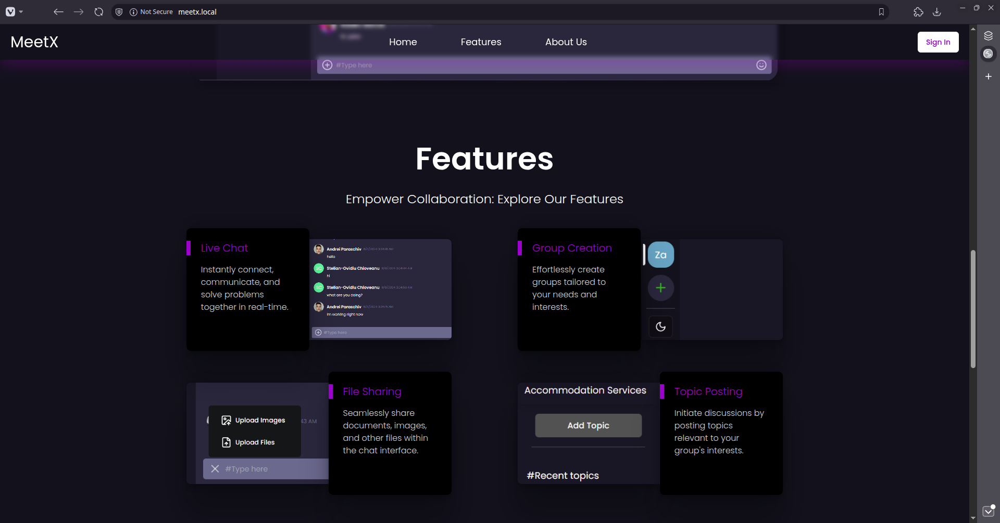
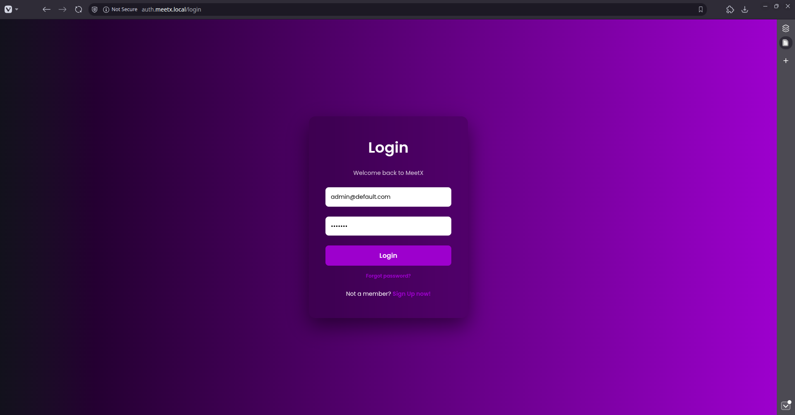
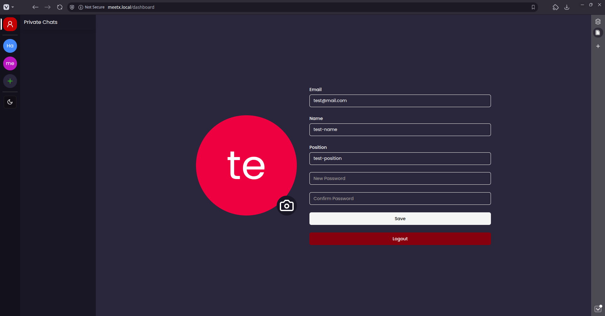
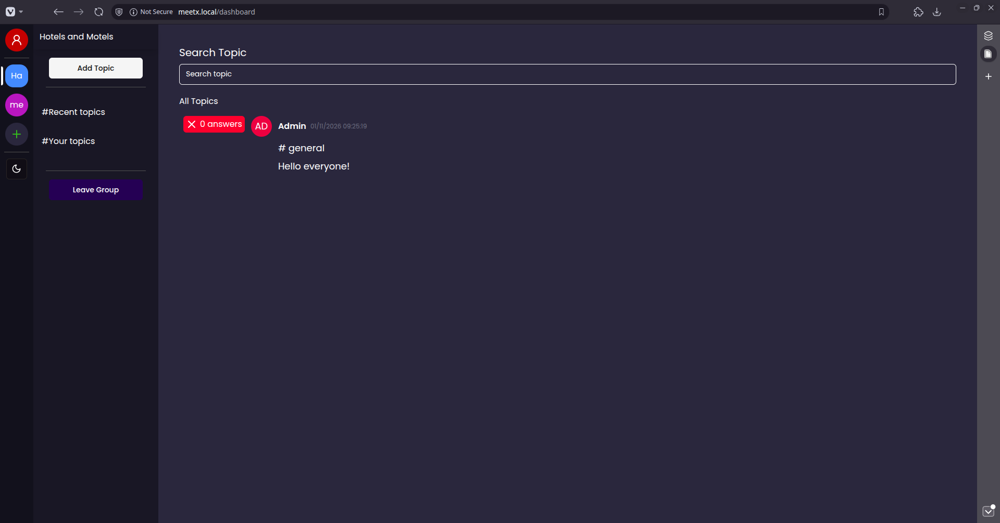
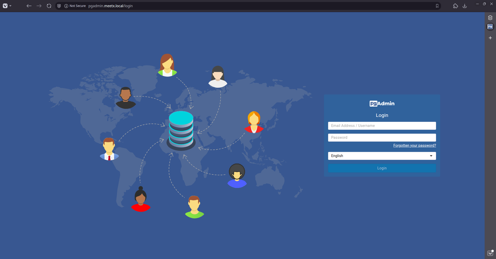
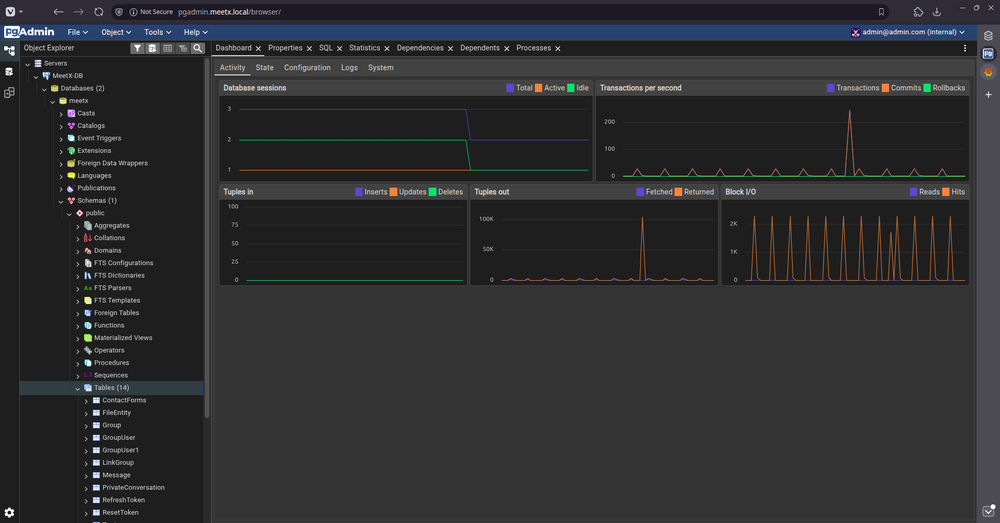
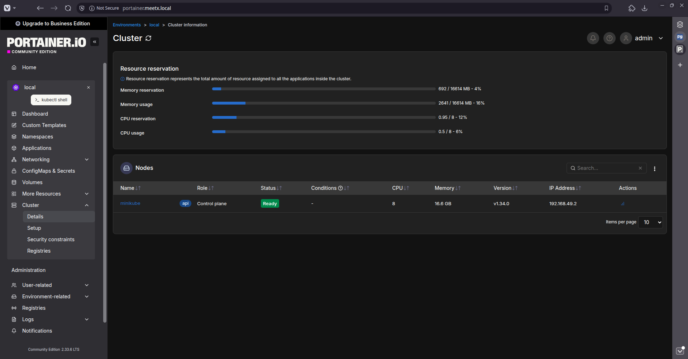
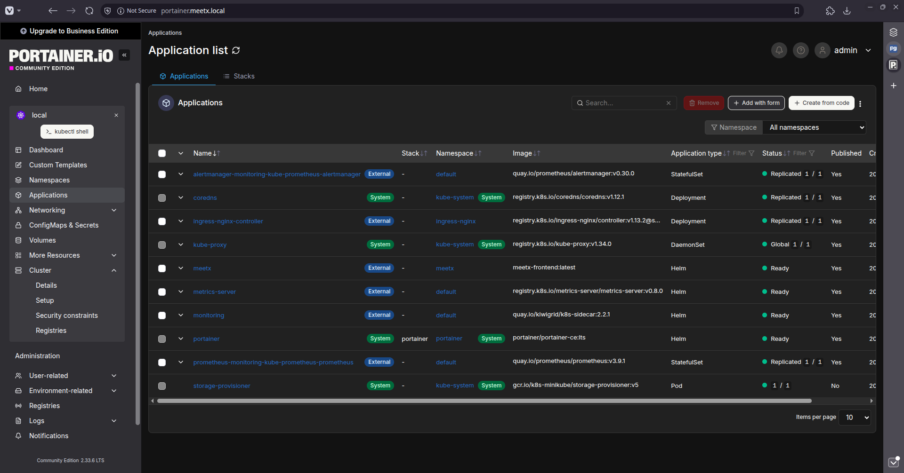
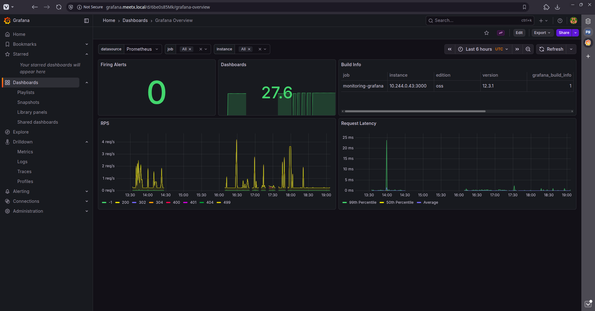
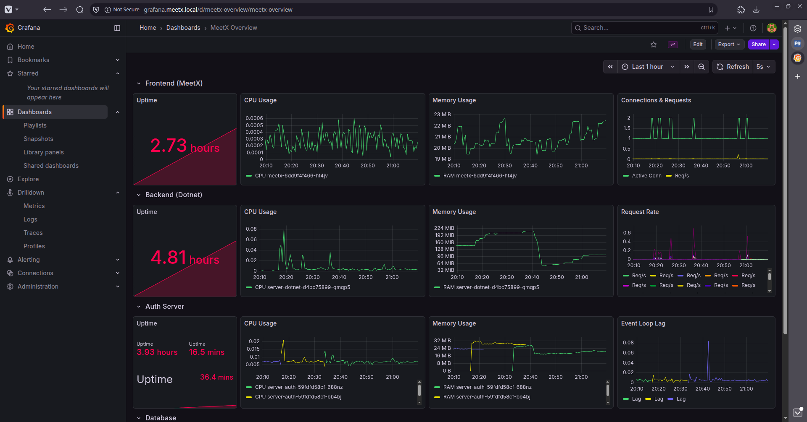

# MeetX

Seamless collaboration among professionals in the same field, enabling easy communication, knowledge sharing, and collective improvement. 
Create chats and groups and share your knowledge with other people from your field.

## Front Page



## Login Pages



## Personal Dashboard & Chats



## PGAdmin



## Portainer



## Grafana




# How to run

## Install Minikube
Install minikube as per the [official docs](https://minikube.sigs.k8s.io/docs/start/) and run `minikube start`.
Install `kubectl` and `k9s` for convenience.

Enable the `ingress` minikube addon for the ingresses to work.
```sh
minikube addons enable ingress
```

## Add Hostnames
Update `/etc/hosts` to add the hostname the local app deployment needs:
1. Run `minikube ip` to get the IP
2. Add the following line to the `/etc/hosts`:
```
<MINIKUBE IP> meetx.local auth.meetx.local api.meetx.local pgadmin.meetx.local portainer.meetx.local grafana.meetx.local alertmanager.meetx.local prometheus.meetx.local
```

## Build Docker Images
Firstly, run `eval $(minikube docker-env)` before the `docker build` commands to ensure that the Minikube's Docker daemon takes care of building the container images. 

Build all the docker images with `docker build <Dockerfile path> -t <image-name:latest>`.
The `meetx-frontend` image has to be deployed using the following additional args:
```sh
docker build -t meetx-frontend:latest \
  --build-arg VITE_BACKEND_URL=http://api.meetx.local \
  --build-arg VITE_AUTH_URL=http://auth.meetx.local \
  ./meetx
```

## Deploy to k8s
Deploy the meetx helm chart with:
```sh
helm install meetx ./charts/meetx
```

## Access the app
Explore the front page and create a new user. Afterwards, explore the user personal page and create chats and groups, with invites for other users.

[Front Page](http://meetx.local)  
[Login Page](http://auth.meetx.local/login)  
[Register Page](http://auth.meetx.local/register)  

## pgadmin
Access `http://pgadmin.meetx.local` or run `minikube service pgadmin -n meetx`. Use the following configuration for accessing the meetx db:
  1. right-click `Servers` > `Register` > `Server`
  2. general tab: set name to `MeetX-DB`
  3. connection tab:
    * hostname/address: `meetx-db` (the internal Kubernetes DNS name for the database service)
    * port: `5432`
    * maintenance database: `meetx`
    * username: `meetx`
    * password: `meetx`

## k8s metrics server
Install k8s metrics server with:
```sh
helm repo add metrics-server https://kubernetes-sigs.github.io/

helm install metrics-server metrics-server/metrics-server
--set args="{--kubelet-insecure-tls,--kubelet-preferred-address-types=InternalIP}"
```

## Portainer
Install the portainer server and agent with:
```sh
helm install portainer ./charts/portainer
```
Access:
[Portainer](portainer.meetx.local)

## Prometheus stack (Prometheus, Grafana, Alertmanager) + Service Monitors

Install the prometheus stack with:
```sh
helm install monitoring ./charts/monitoring 
```
Access:
[Grafana](grafana.meetx.local)
[Prometheus](prometheus.meetx.local)
[Alertmanager](alertmanager.meetx.local)

Then install the service monitors with:
```sh
helm install meetx-service-monitors ./charts/meetx-service-monitors
```
